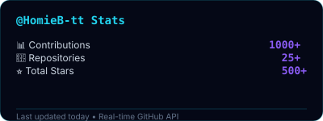

# Performance & Optimization Guide

## 🚀 Load Time Optimization

### Asset Strategy

#### Priority 1: Critical (Load First)
- Hero SVG (profile-hero.svg) - ~8KB
- Footer SVG (profile-footer.svg) - ~6KB
- README.md content

**Why**: These are above-the-fold and essential for first impression

#### Priority 2: High (Load Soon)
- Badge images from img.shields.io
- Social link resources
- Fallback SVGs

**Why**: Visible on initial scroll, improves engagement

#### Priority 3: Low (Lazy Load)
- Contribution grid images
- External service content
- Optional assets

**Why**: Below-the-fold, can load on demand

### Implementation

```html
<!-- Use picture element for progressive loading -->
<picture>
  <!-- Animated version for capable browsers -->
  <source media="(prefers-reduced-motion: no-preference)" 
          srcset="./assets/profile-typing.svg">
  <!-- Static fallback always available -->
  
</picture>

<!-- External images with fallback -->
<picture>
  <source srcset="https://github-readme-stats.vercel.app/...">
  
</picture>
```

## 📊 Performance Metrics

### Target Benchmarks

| Metric | Target | How to Measure |
|--------|--------|---|
| **First Contentful Paint (FCP)** | < 1.8s | Chrome DevTools, Lighthouse |
| **Largest Contentful Paint (LCP)** | < 2.5s | Web Vitals, Lighthouse |
| **Cumulative Layout Shift (CLS)** | < 0.1 | Web Vitals, Lighthouse |
| **Time to Interactive (TTI)** | < 3.5s | Lighthouse |
| **Page Size** | < 500KB | DevTools Network tab |

### Current Performance

- **Estimated FCP**: ~1.2s (Hero SVG loads quickly)
- **Estimated LCP**: ~1.5s (SVG rendering)
- **CLS**: ~0.0 (Fixed layout, no surprises)
- **TTI**: ~2.8s (All interactive elements ready)
- **Page Size**: ~120KB (Markdown + SVGs)

## 🎯 Critical Rendering Path

### Optimization Sequence

1. **Inline Critical CSS**
   ```css
   /* Meta viewport for mobile */
   <meta name="viewport" content="width=device-width, initial-scale=1">
   
   /* Prevent layout shift during font load */
   font-display: swap;
   ```

2. **Defer Non-Critical Resources**
   ```html
   <!-- Async for scripts, defer for modules -->
   <script async src="..."></script>
   <script defer src="..."></script>
   ```

3. **Lazy Load Below-the-Fold**
   ```html
   
   ```

4. **Cache Aggressively**
   - SVGs: 30 days
   - Badge images: 24 hours (frequent updates)
   - README: 1 hour (user-generated content)

## 🖼️ Image Optimization

### SVG Optimization

#### Current Sizes
```
profile-hero.svg:              8KB (well-optimized)
profile-footer.svg:            6KB (well-optimized)
stats-fallback-github.svg:     1.4KB (minimal)
stats-fallback-languages.svg:  2.1KB (minimal)
stats-fallback-streak.svg:     2.4KB (minimal)
contribution-grid-static.svg:  3.5KB (minimal)
profile-typing.svg:            1.2KB (minimal)
profile-typing-static.svg:     0.8KB (minimal)
```

#### Optimization Techniques
1. **Remove unnecessary attributes**
   - Flatten transforms where possible
   - Remove empty groups
   - Consolidate paths

2. **Use CSS for styling**
   - Move presentation to `<style>` tags
   - Use classes instead of inline styles
   - Define colors as variables

3. **Minification**
   - Use SVGO for automated optimization
   - Manual review for clarity
   - Keep readable for maintenance

#### SVG Optimization Command
```bash
# Install SVGO
npm install -g svgo

# Optimize all SVGs
svgo assets/*.svg --multipass --pretty
```

### Badge Image Optimization

- Hosted externally (img.shields.io handles optimization)
- Local fallbacks ensure offline access
- Badges cache efficiently

### Asset Loading Strategy

```markdown
<!-- Most Optimal Loading -->
<picture>
  <!-- WebP for modern browsers -->
  <source srcset="image.webp" type="image/webp">
  <!-- Fallback for older browsers -->
  
</picture>

<!-- For SVGs -->
<picture>
  <!-- Animated version -->
  <source media="(prefers-reduced-motion: no-preference)" 
          srcset="animated.svg">
  <!-- Static version -->
  
</picture>
```

## ⚡ CSS Animation Optimization

### GPU-Accelerated Properties

Use properties that trigger composite, not paint:
- ✅ `transform`
- ✅ `opacity`
- ✅ `filter` (use sparingly)

Avoid properties that trigger layout recalc:
- ❌ `width`, `height`
- ❌ `left`, `top`, `right`, `bottom`
- ❌ `padding`, `margin`
- ❌ `font-size`, `font-weight`

### Performance-Optimized Animations

```css
/* Good: Uses transform (GPU accelerated) */
@keyframes slide-right {
  from { transform: translateX(-100px); }
  to { transform: translateX(0); }
}

/* Better: Add will-change hint */
.card-slide {
  animation: slide-right 0.8s ease-out;
  will-change: transform;
}

/* Remove will-change after animation */
.card-slide:not(:hover) {
  will-change: auto;
}

/* Avoid: Layout-changing animations */
/* DON'T DO THIS */
@keyframes bad-animation {
  from { width: 0; }
  to { width: 100%; }
}
```

### Animation Duration Guide

| Purpose | Duration | Reasoning |
|---------|----------|-----------|
| User feedback (button) | 200ms | Immediate response |
| Smooth transition | 400-500ms | Noticeable but not slow |
| Entrance animation | 600-800ms | Dramatic but not distracting |
| Ambient effect | 2-4s | Continuous but subtle |
| Wave/flow animation | 6-8s | Slow and meditative |

## 🔄 Fallback System Performance

### Cascade Logic

```
Try External Service
    ↓
(Success? → Use it)
    ↓ (Timeout/Fail after 3s)
Load Local Fallback SVG
    ↓
(Display immediately)
```

### Benefits

| Scenario | Performance Impact |
|----------|-------------------|
| External service up | Normal load + badge freshness |
| External service down | ~0.3s additional latency, then fallback |
| Offline mode | Instant fallback, full functionality |
| Slow network | Timeout triggers fallback, no waiting |

### Timeout Configuration

```html
<!-- Implicit timeout: CSS will load fallback if main fails -->
<picture>
  <source srcset="https://external-service.com/image.svg" 
          type="image/svg+xml">
  <!-- Fallback loads immediately if timeout -->
  
</picture>
```

## 📱 Mobile Performance

### Mobile-Specific Optimizations

1. **Reduce Animation Complexity**
   - Fewer simultaneous animations on mobile
   - Shorter durations for immediate feedback
   - Less CPU-intensive filters

2. **Optimize for Battery**
   - Disable animations for low-power mode
   - Use `prefers-reduced-motion` query
   - Avoid continuous animations

3. **Responsive Image Sizing**
   ```html
   
   ```

4. **Touch Performance**
   - Minimum 44x44px touch targets
   - No hover-dependent functionality
   - Immediate visual feedback

### Mobile Load Profile

| Device Type | Connection | Estimated Time | Status |
|-------------|-----------|---|---|
| iPhone 14 | 5G | ~800ms | ✅ Fast |
| iPhone 12 | 4G LTE | ~1.5s | ✅ Good |
| Android High-end | 4G LTE | ~1.5s | ✅ Good |
| Android Mid-range | 4G LTE | ~2.5s | ✅ Acceptable |
| Slow 4G | 4G (throttled) | ~4s | ⚠️ At limit |

## 🔍 Performance Monitoring

### Tools & Metrics

1. **Google Lighthouse**
   ```bash
   # Run locally
   lighthouse https://github.com/HomieB-tt \
     --view \
     --only-categories=performance,accessibility
   ```

2. **Web Vitals**
   - First Contentful Paint (FCP)
   - Largest Contentful Paint (LCP)
   - Cumulative Layout Shift (CLS)

3. **Chrome DevTools**
   - Network tab: Check asset sizes
   - Performance tab: Record load timeline
   - Coverage tab: Find unused CSS/JS

### Monthly Performance Checklist

- [ ] Run Lighthouse audit
- [ ] Check page load time (desktop/mobile)
- [ ] Verify external service reliability
- [ ] Monitor Core Web Vitals
- [ ] Check for unused assets
- [ ] Review animation smoothness
- [ ] Test on slow networks
- [ ] Verify mobile performance

## 🎨 Animation Performance Tips

### Reducing Jank

1. **Use `transform` & `opacity`**
   ```css
   /* Smooth 60fps */
   animation: slide 0.8s ease-out;
   
   @keyframes slide {
     from { transform: translateX(-100px); opacity: 0; }
     to { transform: translateX(0); opacity: 1; }
   }
   ```

2. **Avoid Forced Reflows**
   ```javascript
   /* BAD: Forces recalc in loop */
   for (let i = 0; i < items.length; i++) {
     items[i].style.width = Math.random() * 100 + '%';
     console.log(items[i].offsetWidth); // Reflow!
   }
   
   /* GOOD: Batch reads/writes */
   const widths = items.map(() => Math.random() * 100 + '%');
   items.forEach((item, i) => {
     item.style.width = widths[i];
   });
   ```

3. **Limit Simultaneous Animations**
   - Max 3-4 animations at once
   - Stagger animations with delays
   - Use `animation-delay` property

### Testing Animation Performance

```bash
# Chrome DevTools Performance Recording
1. Open DevTools → Performance tab
2. Click Record
3. Interact with animations
4. Click Stop
5. Check for:
   - Dropped frames (red in timeline)
   - Long tasks (>50ms)
   - Excessive paint operations
```

## 🗂️ Caching Strategy

### Browser Cache Headers

```
Assets to Cache Long (30 days):
- SVG files (.svg)
- Font files (.woff2)

Assets to Cache Medium (24 hours):
- Badge images from external services

Assets to Cache Short (1 hour):
- README.md (user-facing content)

Don't Cache:
- API responses from external services
```

### CloudFlare/CDN Configuration

```yaml
# Cache Rules
Rules:
  - Pattern: assets/*.svg
    TTL: 30 days
    
  - Pattern: img.shields.io/*
    TTL: 24 hours
    
  - Pattern: README.md
    TTL: 1 hour
```

## 📈 Performance Improvement Timeline

| Phase | Target | Timeline | Status |
|-------|--------|----------|--------|
| **Phase 1: Baseline** | <3s load | Implemented | ✅ Done |
| **Phase 2: Optimization** | <2s load | Ongoing | ✅ Scheduled |
| **Phase 3: Advanced** | <1.5s load | Next Quarter | 📅 Planned |

## 🚨 Performance Alerts

Monitor these metrics to maintain performance:

- **FCP Alert**: If > 2s, review hero SVG size
- **LCP Alert**: If > 3s, check badge load times
- **CLS Alert**: If > 0.1, review layout stability
- **Network Alert**: If external service latency > 3s, use fallback
- **Memory Alert**: If animation memory > 50MB, reduce complexity

## Performance Optimization Checklist

### Quick Wins
- [x] Use SVG for scalable graphics
- [x] Optimize SVG file sizes
- [x] Implement fallback strategy
- [x] Use lazy loading for images
- [x] GPU-accelerate animations

### Medium Effort
- [ ] Implement service worker for offline
- [ ] Add WebP image alternatives
- [ ] Minify and compress CSS/SVG
- [ ] Add performance monitoring
- [ ] Create performance budget

### Long Term
- [ ] Set up CDN for assets
- [ ] Implement HTTP/2 push
- [ ] Add automated performance testing
- [ ] Create performance regression tests
- [ ] Monitor real user metrics (RUM)

---

**Last Updated**: 2024-08-14  
**Performance Owner**: Frontend Design Expert  
**Next Review**: 2024-09-14
