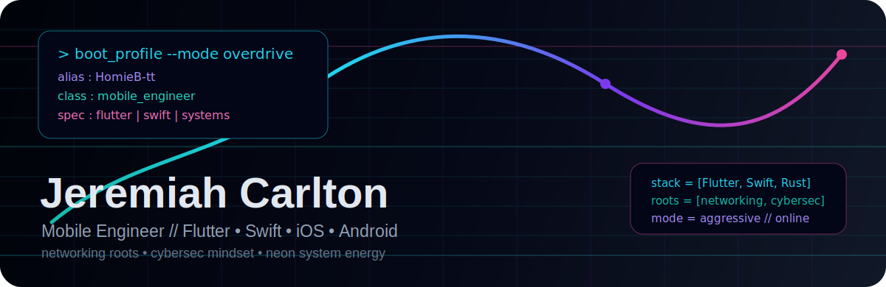
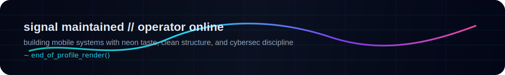

<div align="center">
  

  # JEREMIAH CARLTON

  `MOBILE ENGINEER // FLUTTER • IOS • ANDROID // SYSTEMS-MINDED // NET+CYBER ROOTS`

  <p>
    <a href="https://github.com/HomieB-tt"></a>
    
    
    
  </p>

  <p>
    
  </p>

  
</div>

<p align="center">
  
</p>

## // BOOT LOG

```text
[ identity ] Jeremiah Carlton
[ class    ] Mobile Engineer
[ primary  ] Flutter, Dart, Swift
[ targets  ] iOS, Android
[ extra    ] Python, Rust, Ruby
[ roots    ] Networking, Cybersecurity
[ flavor   ] Neon UI. Clean systems. Aggressive energy.
```

I build mobile products with a systems-first mindset.
I care about fast interfaces, maintainable internals, and software that stays composed under pressure.
My networking and cybersecurity roots still shape how I approach structure, resilience, and engineering discipline.

> WARNING: profile aesthetics may contain elevated levels of teal, violet, neon, terminal syntax, and overclocked mobile-dev energy.

## // TECH ARSENAL

<div align="center">

### MOBILE LAYER


### LANGUAGE LAYER


### SYSTEM SIGNALS


</div>

## // LIVE TELEMETRY

<div align="center">
  
  
</div>

<div align="center">
  
</div>

## // FEATURED NODES

<div align="center">
  <a href="https://github.com/HomieB-tt/HostelHop">
    
  </a>
  <a href="https://github.com/HomieB-tt/Chatter">
    
  </a>
</div>

## // VISUAL NODES [HOSTELHOP]

<div align="center">
  <table>
    <tr>
      <td width="50%">
        
        <p align="center"><i>Mobile Experience: Flutter & Supabase</i></p>
      </td>
      <td width="50%">
        
        <p align="center"><i>Admin Control: React & Vite</i></p>
      </td>
    </tr>
  </table>
</div>

## // CONTRIBUTION TRACE

<div align="center">
  
</div>

## // CONTACT UPLINKS

<div align="center">
  <a href="https://github.com/HomieB-tt"></a>
  <a href="https://www.linkedin.com/in/jeremiah-carlton-21b4962a7/"></a>
  <a href="https://x.com/Jerry_Lander17"></a>
  <a href="mailto:montanajeremy160@outlook.com"></a>
</div>

## // CURRENT SIGNAL

- shipping mobile experiences with Flutter and Swift
- pushing deeper into product-grade iOS and Android engineering
- experimenting with Rust and Python for systems-adjacent tooling
- carrying networking and cybersecurity discipline into every build

## // CURRENTLY BUILDING

```text
[ 01 ] HostelHop          -> student accommodation / booking experience in Flutter
[ 02 ] Mobile systems     -> cleaner iOS + Android engineering patterns
[ 03 ] Cross-stack range  -> Rust, Python, Dart, and Ruby exploration
[ 04 ] Dev identity       -> stronger blend of mobile engineering + cybersec roots
```

I am currently focused on sharpening product-grade mobile engineering while still exploring systems-adjacent tooling and cross-language ideas.

## // SYSTEM DIAGNOSTICS

<div align="center">
  
</div>

```text
[ OS         ] Linux / macOS / Android / iOS
[ SHELL      ] Zsh / Bash / Fish
[ EDITOR     ] VS Code / Cursor / Neovim
[ TOOLING    ] Git / Docker / Supabase CLI / Flutter SDK
[ ENCRYPTION ] OpenSSH / GPG / AES-256 Mindset
```

<p align="center">
  
</p>
