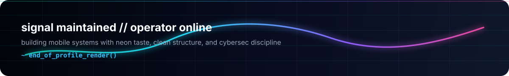

<div align="center">
  

  # JEREMIAH CARLTON

  `MOBILE ENGINEER // FLUTTER • IOS • ANDROID // SYSTEMS-MINDED // NET+CYBER ROOTS`

  <p>
    <a href="#-boot-log"></a>
    <a href="#-tech-arsenal"></a>
    <a href="#-featured-nodes"></a>
    <a href="#-contact-uplinks"></a>
  </p>

  <p>
    <a href="https://github.com/HomieB-tt"></a>
    <a href="https://homieb-tt.github.io/homieb-tt-portfolio/"></a>
    
    
  </p>

  <p>
    
  </p>

  
</div>

<p align="center">
  
</p>

---

<a id="-boot-log"></a>
## // BOOT LOG

```text
[ identity ] Jeremiah Carlton
[ class    ] Mobile Engineer
[ primary  ] Flutter, Dart, Swift
[ targets  ] iOS, Android
[ extra    ] Python, Rust, Ruby
[ roots    ] Networking, Cybersecurity
[ flavor   ] Neon UI. Clean systems. Aggressive energy.
```

I build mobile products with a systems-first mindset.
I care about fast interfaces, maintainable internals, and software that stays composed under pressure.
My networking and cybersecurity roots still shape how I approach structure, resilience, and engineering discipline.

> WARNING: Profile aesthetics contain elevated levels of teal, cyan, violet, neon terminal syntax, and overclocked mobile-dev energy.

---

<a id="-tech-arsenal"></a>
## // TECH ARSENAL

<div align="center">

### MOBILE LAYER


### LANGUAGE LAYER


### INFRASTRUCTURE & TOOLING


### SYSTEM SIGNALS


</div>

<details>
<summary><b>⚡ [CLICK TO EXPAND] Interactive Systems Breakdown & Architecture Stack</b></summary>

<br>

| Core Layer | Technologies & Tools | Engineering Philosophy |
| :--- | :--- | :--- |
| **Mobile Client** | Flutter, Dart, Swift, SwiftUI, iOS, Android SDK | Smooth 60/120fps UI, declarative state, clean architecture |
| **Backend & Data** | Supabase, Firebase, REST APIs, PostgreSQL | Real-time listeners, structured schemas, edge functions |
| **Systems & Tooling** | Python, Rust, Ruby, Shell/Zsh, Docker, Git | High-throughput CLI tools, script automation, containerization |
| **Security & Net** | Networking protocols, App Security, SSH/GPG, OWASP | Secure payload handling, encrypted communications, zero-trust |

</details>

---

<a id="-live-telemetry"></a>
## // LIVE TELEMETRY

<div align="center">
  
  
</div>

<div align="center">
  
</div>

---

<a id="-featured-nodes"></a>
## // FEATURED NODES

<div align="center">
  <table>
    <tr>
      <td width="50%" fill="#050816" stroke="#22d3ee">
        <h3 align="center">
          <a href="https://github.com/HomieB-tt/hostelhop_mobile">📱 HostelHop - Mobile</a>
        </h3>
        <p align="center">Student accommodation & booking experience built with Flutter & Supabase.</p>
        <p align="center">
          
          
          
        </p>
      </td>
      <td width="50%">
        <h3 align="center">
          <a href="https://github.com/HomieB-tt/Chatter">💬 Chatter</a>
        </h3>
        <p align="center">Native iOS messaging application engineered with Swift & SwiftUI.</p>
        <p align="center">
          
          
        </p>
      </td>
    </tr>
    <tr>
      <td width="50%">
        <h3 align="center">
          <a href="https://github.com/HomieB-tt/Whust">🦀 Whust</a>
        </h3>
        <p align="center">High-performance systems utility & engine written in Rust.</p>
        <p align="center">
          
          
        </p>
      </td>
      <td width="50%">
        <h3 align="center">
          <a href="https://github.com/HomieB-tt/hostelhop_admin">🖥️ HostelHop - Admin</a>
        </h3>
        <p align="center">Admin management portal built with React, TypeScript & Vite.</p>
        <p align="center">
          
          
          
        </p>
      </td>
    </tr>
  </table>
</div>

---

## // VISUAL NODES [HOSTELHOP(WEB + MOBILE)]

<div align="center">
  <table>
    <tr>
      <td width="50%" align="center">
        
        <p align="center"><i>Mobile Experience: Flutter & Supabase</i></p>
      </td>
      <td width="50%" align="center">
        
        <p align="center"><i>Admin Control: React + TypeScript & Vite</i></p>
      </td>
    </tr>
  </table>
</div>

---

## // CONTRIBUTION TRACE

<div align="center">
  
</div>

---

<details>
<summary><b>🎵 [NOW_PLAYING] Cyberpunk & Coding Audio Protocol</b></summary>

<br>

```text
[ TRACK  ] Cyberpunk 2077 // Hyper - Spoiler
[ STATUS ] Loop active :: 128 BPM :: Deep Focus State
[ AUDIO  ] Synthwave / Cyberpunk Workstation Mix
```

</details>

---

<a id="-contact-uplinks"></a>
## // CONTACT UPLINKS

<div align="center">
  <a href="https://github.com/HomieB-tt"></a>
  <a href="https://homieb-tt.github.io/homieb-tt-portfolio/"></a>
  <a href="https://www.linkedin.com/in/jeremiah-carlton-21b4962a7/"></a>
  <a href="https://x.com/Jerry_Lander17"></a>
  <a href="mailto:montanajeremy160@outlook.com"></a>
</div>

---

## // CURRENT SIGNAL

- Shipping mobile experiences with Flutter and Swift
- Pushing deeper into product-grade iOS and Android engineering
- Experimenting with Rust and Python for systems-adjacent tooling
- Carrying networking and cybersecurity discipline into every build

---

## // CURRENTLY BUILDING

```text
[ 01 ] HostelHop          -> Student accommodation & booking experience in Flutter
[ 02 ] Mobile Systems     -> Cleaner iOS + Android engineering patterns
[ 03 ] Cross-Stack Range  -> Rust, Python, Dart, and Ruby exploration
[ 04 ] Dev Identity       -> Stronger blend of mobile engineering + cybersec roots
```

I am currently focused on sharpening product-grade mobile engineering while exploring systems-adjacent tooling and cross-language ideas.

---

## // SYSTEM DIAGNOSTICS

<div align="center">
  
</div>

```text
[ OS         ] Linux / macOS / Android / iOS
[ SHELL      ] Zsh / Bash / Fish
[ EDITOR     ] VS Code / Cursor / Neovim
[ TOOLING    ] Git / Docker / Supabase CLI / Flutter SDK
[ ENCRYPTION ] OpenSSH / GPG / AES-256 Mindset
```

<p align="center">
  
</p>
